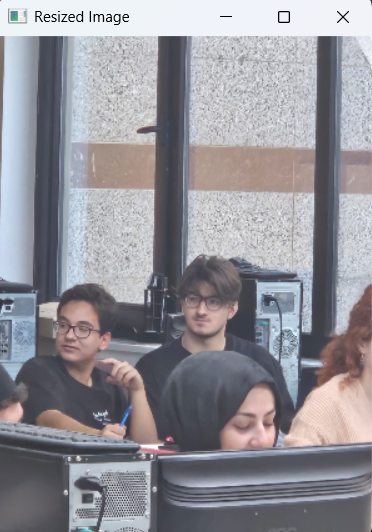
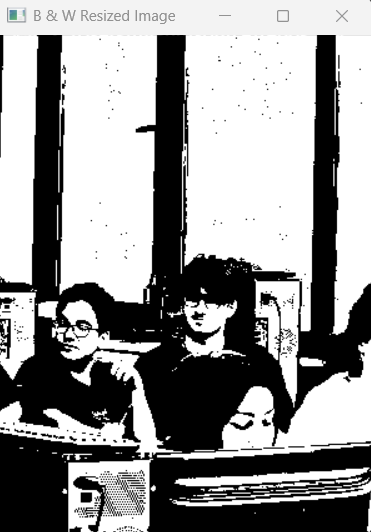

# 📷 Image Resizing and Thresholding with OpenCV (C++)

Bu proje, bir görüntüyü belirli boyutlara ölçeklendiren (`Resize`) ve daha sonra piksel parlaklık değerlerini manuel bir yöntemle değerlendirerek onu **Siyah-Beyaz (Eşiklenmiş/Thresholded)** bir görüntüye dönüştüren basit bir **OpenCV (C++)** uygulamasıdır.

---

## 🚀 Proje Amacı

Temel amaç, OpenCV'nin temel görüntü işleme fonksiyonlarını (özellikle **Boyutlandırma** ve **Eşikleme**) göstererek, bu işlemlerin bir görüntünün piksel verileri üzerinde nasıl uygulandığını anlamaktır.  
Eşikleme işlemi, doğrudan OpenCV'nin `cvtColor` ve `threshold` fonksiyonları yerine, **manuel piksel döngüsü** ile gerçekleştirilerek temel mantığın kavranması hedeflenmiştir.

---

## ⚙️ Gereksinimler

Bu projeyi derlemek ve çalıştırmak için aşağıdaki bileşenlere ihtiyacınız vardır:

* **C++ Derleyicisi:** GCC/G++ veya Visual Studio 2022 gibi bir derleyici.  
* **OpenCV Kütüphanesi:** Sisteminizde kurulu ve projenize doğru şekilde bağlanmış olmalıdır (Genellikle CMake ile yapılandırılır).  
* **Görüntü Dosyası:** Kod içinde okunan adrese bir görüntü (`test.jpg`) yerleştirilmiş olmalıdır.  

---

## 🛠️ Kurulum ve Çalıştırma

1.  **OpenCV Kurulumu:** İşletim sisteminize uygun şekilde OpenCV kütüphanesini kurun.  
2.  **Dosya Hazırlığı:** Projenin çalışacağı dizine, kod içinde belirtilen yola (`C:/Users/mrshn/Desktop/test.jpg` yerine kendi dosya yolunuzu kullanın) bir test görüntüsü yerleştirin ve adını `test.jpg` yapın.  
3.  **Derleme:** Gerekli OpenCV başlıkları ve kütüphaneleri ile C++ dosyasını derleyin. Örneğin, Linux veya macOS üzerinde:

    ```bash
    g++ main.cpp -o image_processor $(pkg-config opencv --cflags --libs)
    ```

4.  **Çalıştırma:** Derlenen programı çalıştırın:

    ```bash
    ./image_processor
    ```

---

## 💻 Kod Açıklaması

Bu projede, gri tonlama dönüşümü için yaygın olarak kullanılan ağırlıklı ortalama formülü kullanılarak, her pikselin parlaklık değeri **128** eşik değeriyle karşılaştırılır.

\[
Y = 0.299 \cdot R + 0.587 \cdot G + 0.114 \cdot B
\]

- **R**: Kırmızı kanal değeri  
- **G**: Yeşil kanal değeri  
- **B**: Mavi kanal değeri  

### 📷 Görseller

| Resize | Threshold |
|--------|-----------|
|  |  |


